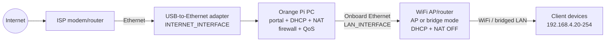
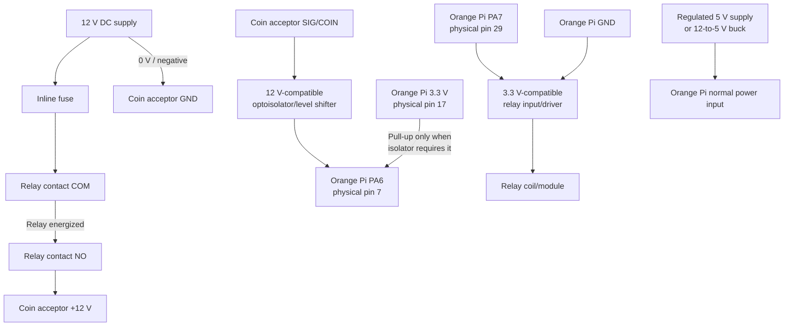

# Orange Pi PC Installation and Module Wiring Guide

This guide deploys this repository on an **Orange Pi PC** as a wired PISO
WiFi gateway. The Orange Pi receives internet through a USB-to-Ethernet
adapter and sends controlled client traffic through its onboard Ethernet port
to an external WiFi access point in bridge/AP mode.

The instructions are intentionally native (systemd + Python), not Docker.
The repository's default Compose file sets `MANAGE_HARDWARE=false` and is for
web-development only. The older `install_ubuntu.sh` and
`dev_setup_native.sh` scripts also do not match the current wired production
configuration, so do not use them for this installation.

## 1. Safety and compatibility gates

Read this section before applying power.

> [!DANGER]
> The Orange Pi GPIO pins use **3.3 V logic**. Never connect 5 V or 12 V to
> PA6, PA7, or any other GPIO. A 12 V connection can permanently destroy the
> Orange Pi and may create a fire hazard.

> [!WARNING]
> Disconnect the Orange Pi supply and the 12 V coin-acceptor supply before
> changing wiring. Fuse the 12 V branch, insulate exposed terminals, add
> strain relief, and keep GPIO wiring separated from power wiring. This guide
> covers low-voltage DC only. Have a qualified electrician handle any mains
> AC wiring.

> [!CAUTION]
> The portal and admin login currently share plain HTTP port 5000. Do not log
> in as admin over the customer WiFi. Use a trusted wired management path or
> an SSH tunnel, enable WPA2/WPA3 and client isolation on the AP, block port
> 5000 from the untrusted USB-uplink network, and never port-forward it from
> the internet. The application firewall now adds that uplink DROP rule; this
> guide requires verifying it on the target. Add a tested TLS reverse proxy or
> separate management network before using remote administration in production.

Before installation, confirm all of the following:

- The board is an Orange Pi PC/PC Plus H3-family board with the documented
  40-pin header. Check the exact board revision and pin-1 orientation.
- The OS exposes the legacy sysfs GPIO interface used by `coinslot.py`:
  `test -e /sys/class/gpio/export` must succeed.
- The coin acceptor is a pulse-output model such as a CH-926-compatible unit.
- The acceptor pulse output is verified with its manual and a meter or scope.
- The relay **module input** is 3.3 V logic compatible. Never connect a bare
  relay coil directly to GPIO.
- The external router can run in true AP/bridge mode with DHCP and NAT off.

GPIO sysfs is deprecated on newer Linux kernels. If
`/sys/class/gpio/export` is missing, leave `COINSLOT_ENABLED=false`; the
current GPIO driver must be migrated to libgpiod before the coinslot can be
used on that image.

Existence of sysfs alone is not enough. Before setting GPIO numbers, identify
the gpiochip that owns the H3 PA bank on the exact installed kernel:

```bash
for chip in /sys/class/gpio/gpiochip*; do
  echo "$(basename "$chip") label=$(cat "$chip/label") base=$(cat "$chip/base") ngpio=$(cat "$chip/ngpio")"
done
sudo cat /sys/kernel/debug/gpio 2>/dev/null || true
```

The legacy values `6` and `7` are valid only when the PA-bank gpiochip base is
`0`, making PA6 `base + 6` and PA7 `base + 7`. The chip label should identify
the Allwinner H3 pin controller and its `ngpio` range must cover both lines.
If the PA-bank base is different, use `base + 6` and `base + 7` in `.env` and
all manual commands below. If the controller-to-header mapping cannot be
proven from the exact image's pinctrl/debug data, keep the coinslot disabled.

## 2. Bill of materials

- Orange Pi PC with heatsink and a reliable microSD card
- Regulated 5 V supply rated for at least 2 A; 3 A is recommended when using
  USB peripherals
- USB-to-Ethernet adapter supported by Armbian
- External WiFi router/access point, optionally with a separate PoE switch
- Two Ethernet cables
- 12 V pulse-output coin acceptor
- Regulated 12 V supply sized for the acceptor, with an inline fuse
- One-channel relay **module** with:
  - contacts rated above the acceptor's DC voltage/current and inrush;
  - a transistor/opto driver and flyback protection; and
  - a verified 3.3 V-compatible input
- 12 V-compatible optocoupler/level-shifter module between the acceptor and
  PA6
- 4.7 kΩ to 10 kΩ resistor if the isolator's 3.3 V output is open collector
  and its datasheet requires a pull-up
- Optional 10 kΩ PA7 pull-up for a compatible active-low relay input
- Multimeter; an oscilloscope or logic analyzer is strongly recommended
- Insulated enclosure, terminal blocks, ferrules, and strain relief

If a single 12 V supply is used, power the Orange Pi through a properly sized
12 V-to-5 V buck converter connected to its normal 5 V power input. Verify the
converter output before connecting the board. **Never feed 12 V to the Orange
Pi power jack, USB port, or 40-pin header.**

## 3. System architecture



Traffic must pass through the Orange Pi:

```text
Internet/ISP router
        |
        | USB-to-Ethernet uplink (often eth1 or enx<MAC>)
        v
Orange Pi PC [NAT, firewall, DHCP, portal, time accounting]
        |
        | onboard Ethernet client LAN (often eth0)
        v
External AP in bridge mode ---- WiFi clients
```

The external AP must not route or NAT. Otherwise, the Orange Pi sees only the
AP's MAC address and cannot control individual customers.

## 4. Orange Pi PC pins used by this project

The `COINSLOT_GPIO` values are legacy **sysfs GPIO numbers**, not physical
header positions, Raspberry Pi BCM numbers, or wiringPi numbers.

| Purpose | SoC name | Physical header pin | `.env` sysfs value | Normal idle state |
|---|---:|---:|---:|---|
| Conditioned coin pulse input | PA6 | 7 | `COINSLOT_GPIO=6` | About 3.3 V; pulse falls LOW |
| Relay control | PA7 | 29 | `COINSLOT_RELAY_GPIO=7` | HIGH when default active-low relay is off |
| 3.3 V pull-up supply | — | 17 (or 1) | — | 3.3 V only |
| Ground near pulse input | — | 6 or 9 | — | Ground |
| Ground near relay control | — | 30 | — | Ground |

Minimal header reference, viewed from above with the board's pin-1 marking:

```text
Orange Pi PC 40-pin header (selected pins only)

  3.3 V  [ 1] [ 2]  5 V
  PA6    [ 7] [ 8]  PA13
  GND    [ 9] [10]  PA14
          ...
  PA7    [29] [30]  GND

PA6: physical pin 7,  legacy sysfs GPIO 6
PA7: physical pin 29, legacy sysfs GPIO 7
```

Pin **6** is a physical GND pin, while the number `6` in
`COINSLOT_GPIO=6` means PA6/sysfs GPIO 6. Do not confuse these numbering
systems.

## 5. Power and module wiring

### 5.1 Complete low-voltage diagram



### 5.2 Relay contact wiring (12 V side)

```text
12 V PSU +  ---- inline fuse ---- relay COM
relay NO    --------------------- coin acceptor +12 V
12 V PSU -  --------------------- coin acceptor GND
relay NC    --------------------- not connected
```

Use **COM + NO**, never COM + NC. With NO, loss of relay power opens the
acceptor's 12 V feed. A software crash alone may leave a GPIO output latched
until systemd restarts the application, so NO contacts and a hardware
default-OFF bias remain necessary.

Do not rely on wire color or terminal left-to-right order; clone acceptors and
relay boards vary. Follow the printed labels/manual and verify COM/NO with a
continuity meter while everything is unpowered.

### 5.3 Relay control wiring (3.3 V logic side)

| Orange Pi | Connect to | Notes |
|---|---|---|
| PA7, physical pin 29 | Relay driver/module `IN` | Input must accept 3.3 V logic |
| GND, physical pin 30 | Relay logic `GND` | Required for non-isolated/common-ground inputs |
| Rated supply | Relay module `VCC/JD-VCC` | Follow that exact module's datasheet |

For the default `COINSLOT_RELAY_ACTIVE_HIGH=false`, PA7 HIGH means relay off
and PA7 LOW means relay on. If compatible with the module, add an external
10 kΩ pull-up from PA7 to 3.3 V to help hold OFF while the Pi's 3.3 V rail is
present and GPIO is high-impedance. This cannot override a GPIO latched LOW,
and it provides no bias when the Pi is unpowered. Select a driver whose own
input bias stays OFF across Pi/relay power-up order, test that state, and do
not use a module whose input can back-feed PA7.

### 5.4 Coin pulse input

Preferred isolated connection:

```text
Coin acceptor SIG and its reference
        |
        v
12 V-compatible optocoupler/level-shifter input
        || electrical isolation ||
isolator OUT --------------------- PA6, physical pin 7
isolator output GND -------------- Orange Pi GND
isolator output VCC -------------- Orange Pi 3.3 V (if required)
PA6 ------- 4.7k-10k pull-up ----- Orange Pi 3.3 V
             (only if required by the isolator output)
```

The exact acceptor-side optocoupler input depends on whether that acceptor
sinks or sources its pulse. Follow its manual and the isolator datasheet; do
not guess from wire color. The referenced CH-926 manual specifically warns
against adding a pull-up on its signal wire, so the pull-up shown above is
only on an open-collector **isolator output**, never directly on the acceptor
SIG wire. A direct SIG-to-PA6 connection is not part of this recommended
installation.

The application watches **falling edges**, so the measured signal must idle
near 3.3 V and pulse LOW. Configure the coin acceptor so pulse count is
proportional to peso value. With `COINSLOT_PULSES_PER_PESO=1`, a ₱1 coin must
produce one pulse and a ₱5 coin must produce five pulses.

## 6. Flash and prepare Armbian

1. Use [Armbian Imager](https://docs.armbian.com/User-Guide_Getting-Started/)
   to flash an Orange Pi PC **Minimal** or **Server** image to the microSD
   card. Prefer Armbian's current/LTS option unless the board page identifies
   a hardware compatibility reason to use another branch.
2. For initial setup, connect the onboard Ethernet port directly to the
   existing internet router. Do not connect the client AP yet.
3. Insert the microSD card, connect HDMI/keyboard or use SSH, then apply 5 V
   power.
4. Complete Armbian's first-login password and sudo-user prompts.
5. Update the OS and reboot:

   ```bash
   sudo apt update
   sudo apt full-upgrade -y
   sudo reboot
   ```

6. After reboot, verify the board and GPIO interface:

   ```bash
   uname -a
   cat /etc/os-release
   test -e /sys/class/gpio/export && echo "sysfs GPIO available" || echo "sysfs GPIO MISSING"
   ```

Do not continue with coinslot wiring if sysfs GPIO is missing.

## 7. Install system and Python dependencies

```bash
sudo apt update
sudo apt install -y \
  git python3 python3-venv python3-pip python3-dev build-essential \
  dnsmasq iptables iproute2 sqlite3 openssl
```

Install the application under `/opt`:

```bash
sudo git clone https://github.com/fglend/Piso-WiFi.git /opt/piso_wifi
sudo chown -R "$USER":"$USER" /opt/piso_wifi
cd /opt/piso_wifi

python3 -m venv venv
venv/bin/pip install --upgrade pip
venv/bin/pip install -r requirements.txt
```

The application creates and migrates its SQLite tables automatically on first
start. There is no `manage.py` database initialization command in this repo.

## 8. Identify and configure network interfaces

1. Plug the USB-to-Ethernet adapter into the Orange Pi, but leave its network
   cable disconnected for the moment.
2. Record interface names and MAC addresses:

   ```bash
   ip -br link
   for interface in /sys/class/net/e*; do
     printf '%s  ' "$(basename "$interface")"
     cat "$interface/address"
   done
   ```

3. Identify:

   - `LAN_INTERFACE`: onboard Ethernet facing customers, commonly `eth0` or
     `end0`.
   - `INTERNET_INTERFACE`: USB Ethernet facing the ISP router, commonly
     `eth1` or `enx<adapter-mac>`.

4. Inspect every active Netplan definition and renderer before editing:

   ```bash
   ls -la /etc/netplan
   sudo netplan get
   networkctl status 2>/dev/null || true
   nmcli general status 2>/dev/null || true
   ```

5. Configure only the USB uplink for DHCP. The application assigns
   `192.168.4.1/24` to the client LAN itself. Current Armbian releases use
   Netplan; Minimal images normally use `systemd-networkd`.

   Back up the existing configuration:

   ```bash
   sudo cp -a /etc/netplan /etc/netplan.backup
   sudoedit /etc/netplan/10-dhcp-all-interfaces.yaml
   ```

   Edit or disable the actual catch-all/overlapping YAML files found above;
   do not leave two definitions matching the same interface. The final merged
   configuration should contain exact interface matches like this, changing
   `eth0` and `enx001122334455` to the names found above and using the renderer
   reported by the installed image:

   ```yaml
   network:
     version: 2
     renderer: networkd
     ethernets:
       portal-lan:
         match:
           name: "eth0"
         dhcp4: false
         dhcp6: false
         link-local: []
         optional: true
       internet-uplink:
         match:
           name: "enx001122334455"
         dhcp4: true
         dhcp6: false
         optional: false
   ```

6. Apply this change from a local HDMI/serial console because it can disconnect
   SSH:

   ```bash
   sudo netplan generate
   sudo netplan try
   sudo netplan apply
   ```

7. Rewire the topology: ISP router LAN -> USB Ethernet adapter; onboard
   Ethernet -> external AP LAN/bridge port.
8. Confirm the USB adapter has an address, default route, and internet:

   ```bash
   ip -br addr
   ip route
   ping -c 3 1.1.1.1
   ```

## 9. Configure the external access point

Use the AP vendor interface to set:

- Operating mode: **Access Point** or **Bridge**
- DHCP server: **Off**
- NAT/router/firewall mode: **Off**
- Management address: `192.168.4.2/24`
- Management gateway/DNS: `192.168.4.1`
- SSID and WiFi security: choose site-specific values
- Uplink: a LAN/bridge port, not a routed WAN port unless the vendor's AP mode
  explicitly bridges it

Use a client DHCP range starting at `.20` so the AP management address cannot
conflict with a customer device.

## 10. Create the production environment file

```bash
cd /opt/piso_wifi
cp .env.example .env
openssl rand -hex 32
venv/bin/python -c "from werkzeug.security import generate_password_hash; print(generate_password_hash('REPLACE_WITH_A_LONG_ADMIN_PASSWORD'))"
sudoedit .env
```

Put the generated values into `.env`. At minimum, use this wired production
configuration and replace every placeholder:

```dotenv
FLASK_ENV=production
FLASK_HOST=0.0.0.0
FLASK_PORT=5000
SECRET_KEY=PASTE_RANDOM_SECRET_HERE

ADMIN_USERNAME=admin
ADMIN_PASSWORD_HASH=PASTE_WERKZEUG_HASH_HERE
ADMIN_PASSWORD=

DB_PATH=config/piso_wifi.db
MANAGE_HARDWARE=true
NETWORK_MODE=wired
LAN_INTERFACE=eth0
INTERNET_INTERFACE=enx001122334455

AP_IP=192.168.4.1
DHCP_RANGE_START=192.168.4.20
DHCP_RANGE_END=192.168.4.254
NETWORK_MASK=255.255.255.0

CHECK_INTERVAL=5
PAUSE_ON_DISCONNECT=true
DEFAULT_DOWNLOAD_KBPS=2048
DEFAULT_UPLOAD_KBPS=1024

COINSLOT_ENABLED=false
COINSLOT_GPIO=6
COINSLOT_PULSES_PER_PESO=1
COINSLOT_CLAIM_TIMEOUT=60
COINSLOT_DEBOUNCE_MS=50
COINSLOT_RELAY_GPIO=7
COINSLOT_RELAY_ACTIVE_HIGH=false
```

Start with `COINSLOT_ENABLED=false`. Complete the network-only validation
before enabling physical GPIO. Bandwidth values remain stored internally in
kbps even though the portal displays Mbps.

Protect configuration and database files:

```bash
sudo chown -R root:root /opt/piso_wifi
sudo chmod 600 /opt/piso_wifi/.env
sudo install -d -o root -g root -m 700 /opt/piso_wifi/config /opt/piso_wifi/logs
sudo install -d -o root -g root -m 755 /opt/piso_wifi/static/uploads
sudo test ! -e /opt/piso_wifi/config/piso_wifi.db || sudo chmod 600 /opt/piso_wifi/config/piso_wifi.db
```

## 11. Install the systemd service

The current hardware controller must run as root because it configures
interfaces, dnsmasq, iptables, `tc`, `/proc` forwarding, and sysfs GPIO. Run
exactly one Gunicorn worker so multiple processes do not compete for GPIO,
SQLite, and network rule ownership.

```bash
sudoedit /etc/systemd/system/pisowifi.service
```

```ini
[Unit]
Description=PISO WiFi gateway
Wants=network-online.target
After=network-online.target

[Service]
Type=simple
User=root
Group=root
WorkingDirectory=/opt/piso_wifi
UMask=0077
ExecStart=/opt/piso_wifi/venv/bin/gunicorn --workers 1 --bind 0.0.0.0:5000 --timeout 120 "main:create_app()"
Restart=on-failure
RestartSec=1
TimeoutStopSec=15

[Install]
WantedBy=multi-user.target
```

Enable and start it:

```bash
sudo systemctl daemon-reload
sudo systemctl enable --now pisowifi
sudo systemctl status pisowifi --no-pager
sudo journalctl -u pisowifi -n 100 --no-pager
```

The application writes `/etc/dnsmasq.conf`, restarts dnsmasq, assigns the LAN
address, enables forwarding, creates the `PISOWIFI` iptables chain, configures
NAT, and initializes `tc`. Back up any pre-existing dnsmasq/firewall
configuration before deploying this appliance.

`python-dotenv` loads `/opt/piso_wifi/.env` from the working directory. Do not
also pass `.env.example` syntax through systemd `EnvironmentFile`; systemd and
python-dotenv do not interpret all inline comments identically.

For administration, SSH from a trusted management machine and forward the
loopback service instead of entering credentials on customer WiFi:

```bash
ssh -L 5000:127.0.0.1:5000 your-admin-user@ORANGE_PI_UPLINK_IP
```

Then open `http://127.0.0.1:5000/login` locally. This tunnel protects the
admin credentials in transit; it does not add TLS to customer portal traffic.

## 12. Validate the network-only installation

On the Orange Pi:

```bash
ip -br addr
ip route
systemctl is-active pisowifi dnsmasq
ss -lntup | grep ':5000'
cat /proc/sys/net/ipv4/ip_forward
sudo iptables -S PISOWIFI
sudo iptables -S INPUT
sudo iptables -t nat -S POSTROUTING
sudo iptables -S FORWARD
sudo tc qdisc show dev eth0
sudo cat /var/lib/misc/dnsmasq.leases
ip neigh show dev eth0
```

Replace `eth0` with the configured `LAN_INTERFACE`.

On a phone connected to the external AP:

1. Confirm it receives `192.168.4.20-254`.
2. Confirm gateway and DNS are both `192.168.4.1`.
3. Open `http://192.168.4.1:5000` explicitly. The current implementation
   does not add an HTTP redirect/DNAT rule, so do not rely on an automatic
   captive-portal popup.
4. Do **not** sign in as admin from the customer phone. Use the trusted SSH
   tunnel from Section 11, then open `http://127.0.0.1:5000/login` locally.
5. Confirm `iptables -S INPUT` drops TCP port 5000 arriving from
   `INTERNET_INTERFACE` while the portal remains reachable from the client LAN.
6. Confirm different clients appear with different MAC addresses.
7. Confirm an unpaid client can reach the portal but not the internet.
8. Add time and confirm a complete paid-client request and reply both work.
   Confirm `iptables -S FORWARD` contains the uplink-to-LAN
   `ESTABLISHED,RELATED` rule before commissioning the coinslot.

If clients receive an address from the external router instead of the Orange
Pi, return to Section 9 and disable DHCP/router mode on the external AP.

## 13. Commission GPIO and relay without the acceptor

Keep the coin acceptor's 12 V wire disconnected from relay NO during this
test.

1. Stop the application:

   ```bash
   sudo systemctl stop pisowifi
   ```

2. Confirm sysfs GPIO exists:

   ```bash
   sudo test -e /sys/class/gpio/export
   ```

3. Reconfirm the PA-bank gpiochip base as described in Section 1. The example
   below is allowed only after proving PA7 is sysfs GPIO 7. Export it if needed
   and set the default active-low OFF state atomically:

   ```bash
   sudo sh -c 'test -d /sys/class/gpio/gpio7 || echo 7 > /sys/class/gpio/export'
   sudo sh -c 'echo high > /sys/class/gpio/gpio7/direction'
   sudo cat /sys/class/gpio/gpio7/value
   ```

   The result must be `1`, and the relay must be released. If it energizes,
   stop: the relay polarity or module input is not what the configuration
   expects.

4. With no acceptor load connected, briefly energize and release the default
   active-low relay while checking COM/NO continuity. Run this as one command;
   its EXIT trap restores OFF even if the sleep is interrupted:

   ```bash
   sudo sh -c 'trap "echo 1 > /sys/class/gpio/gpio7/value" EXIT INT TERM; echo 0 > /sys/class/gpio/gpio7/value; sleep 2'
   sudo cat /sys/class/gpio/gpio7/value
   ```

5. Unexport the test pin so the application can own it:

   ```bash
   sudo sh -c 'echo 7 > /sys/class/gpio/unexport'
   ```

6. Repeat boot and power-cycle tests. The relay must remain released until a
   portal coin claim starts. If the relay module remains powered while the
   Orange Pi is off, verify the external PA7 default-OFF bias under that state
   too.

For an active-high module, use `COINSLOT_RELAY_ACTIVE_HIGH=true`; its OFF
state is GPIO `0`. Verify electrically rather than assuming the setting.

## 14. Connect and commission the coin acceptor

1. Power everything off.
2. Complete the fused COM/NO power wiring and the conditioned PA6 pulse
   wiring from Section 5.
3. Check for shorts between 12 V, 5 V, 3.3 V, and ground before powering.
4. Power the Orange Pi first. Confirm the relay remains released.
5. Enable coinslot support:

   ```bash
   sudoedit /opt/piso_wifi/.env
   # Set COINSLOT_ENABLED=true
   sudo systemctl restart pisowifi
   sudo journalctl -u pisowifi -f
   ```

6. Confirm the service log reports SIG GPIO 6 and relay GPIO 7 without a
   permission/export error.
7. Confirm the acceptor remains unpowered before a claim.
8. From a connected phone, tap **Start coin session**. Confirm:
   - relay COM/NO closes;
   - the acceptor powers up;
   - the countdown is visible;
   - the relay opens again after timeout and after a physically verified
     graceful service stop.
9. Insert one coin while watching the logs and portal. Confirm the expected
   pulse count, peso amount, time credit, and transaction source.
10. Repeat for every accepted denomination.

`COINSLOT_DEBOUNCE_MS=50` ignores edges closer than 50 ms. If valid acceptor
pulses are spaced 50 ms or less, lower it carefully after measuring the pulse
train; too little debounce can count electrical noise as money.

## 15. End-to-end acceptance checklist

- [ ] USB uplink receives an ISP-router address and default route.
- [ ] Client LAN is `192.168.4.1/24` on the Orange Pi only.
- [ ] External AP has DHCP/NAT off and a non-conflicting management address.
- [ ] Two phones receive different Orange Pi DHCP leases and expose distinct
      MAC addresses to the admin dashboard.
- [ ] Unpaid devices reach the portal but not the internet.
- [ ] Cash/voucher credit enables access and applies the configured speed.
- [ ] Balance decreases only under the configured presence policy.
- [ ] With a claim active, a field test proves the relay is released during
      graceful `systemctl stop pisowifi`; this remains mandatory even though
      automated tests cover cleanup registration and ordering.
- [ ] Relay closes only during a valid phone claim.
- [ ] PA6 idles near 3.3 V and pulses LOW without ever exceeding 3.3 V.
- [ ] Every denomination produces the configured pulse/peso total.
- [ ] Reboot restores the database and reconciles active user access.
- [ ] Enclosure, fuse, insulation, cooling, and strain relief are complete.

## 16. Troubleshooting

### Service refuses to start in production

The application rejects known default secrets. Check `SECRET_KEY` and
`ADMIN_PASSWORD_HASH` in `.env`:

```bash
sudo journalctl -u pisowifi -n 100 --no-pager
```

### `Required command ... not found`

Install the missing package. In wired mode the controller requires
`dnsmasq`, `ip`, `iptables`, and `tc`.

### LAN interface gets an unexpected DHCP address

Armbian's catch-all Netplan definition is still managing the client LAN.
Revisit Section 8 so only the USB uplink uses DHCP, then restart the service.

### All clients appear as one MAC

The external router is still routing/NATing. Enable true AP/bridge mode and
connect through its bridge/LAN port.

### Clients have WiFi but no portal

```bash
ip addr show dev eth0
sudo systemctl status dnsmasq pisowifi
sudo cat /var/lib/misc/dnsmasq.leases
ss -lntp | grep ':5000'
```

Open `http://192.168.4.1:5000` directly.

### Portal works but paid clients have no internet

```bash
ip route
ping -c 3 1.1.1.1
sudo iptables -t nat -S POSTROUTING
sudo iptables -S PISOWIFI
sudo iptables -S FORWARD
```

Confirm `INTERNET_INTERFACE` is the USB uplink, not the client LAN.

### Relay clicks during boot

Disconnect the acceptor immediately. Confirm this checkout includes the relay
initialization regression fix, verify `COINSLOT_RELAY_ACTIVE_HIGH`, check the
external default-OFF bias, and test PA7 with the acceptor disconnected.

### Relay never releases after a stop or application crash

The application registers graceful shutdown cleanup that stops the coinslot
before the meter. Confirm the installed service/code is current and inspect
its logs if `systemctl stop` does not release the relay. SIGKILL, kernel panic,
power-domain sequencing, or hardware failure can still leave sysfs/output
states outside software control. Use COM/NO plus a suitable hardware
watchdog/timer if guaranteed release after any failure is required.

### Coin pulses are missing or over-counted

- Confirm a claim is active; pulses without a claim are intentionally ignored.
- Measure SIG voltage and polarity at PA6.
- Confirm idle HIGH and falling-edge pulses.
- Verify `COINSLOT_PULSES_PER_PESO` and acceptor programming.
- Compare pulse spacing with `COINSLOT_DEBOUNCE_MS`.
- Improve grounding, shielding, or optoisolation if noise is present.

## 17. Backup and maintenance

Back up at least:

```text
/opt/piso_wifi/.env
/opt/piso_wifi/config/piso_wifi.db
/opt/piso_wifi/static/uploads/
/etc/systemd/system/pisowifi.service
/etc/netplan/
```

Before an application update:

```bash
sudo systemctl stop pisowifi
sudo cp -a /opt/piso_wifi/config/piso_wifi.db "/opt/piso_wifi/config/piso_wifi.db.$(date +%F-%H%M).bak"
cd /opt/piso_wifi
sudo git pull --ff-only
sudo venv/bin/pip install -r requirements.txt
sudo venv/bin/pytest -q
sudo systemctl start pisowifi
sudo systemctl status pisowifi --no-pager
```

After an Armbian kernel update, recheck sysfs GPIO and repeat the relay OFF
test before accepting coins.

## References

- [Orange Pi PC product page and pinout](https://www.orangepi.org/html/hardWare/computerAndMicrocontrollers/details/Orange-Pi-PC.html)
- [Manufacturer-hosted Orange Pi PC Plus manual, matching H3-family 40-pin table](https://www.orangepi.net/wp-content/uploads/2023/03/Orange-Pi-PC-Plus-User-Manual_v3.2.pdf)
- [Armbian getting started](https://docs.armbian.com/User-Guide_Getting-Started/)
- [Armbian networking and Netplan](https://docs.armbian.com/User-Guide_Networking/)
- [CH-926-compatible coin acceptor manual](https://info-gate.gr/images/coin-acceptor/Manual%20CH926.pdf)

Treat the manuals for the exact coin acceptor, relay module, power supply, and
external AP purchased for the build as authoritative when their terminals or
electrical behavior differ from this guide.
